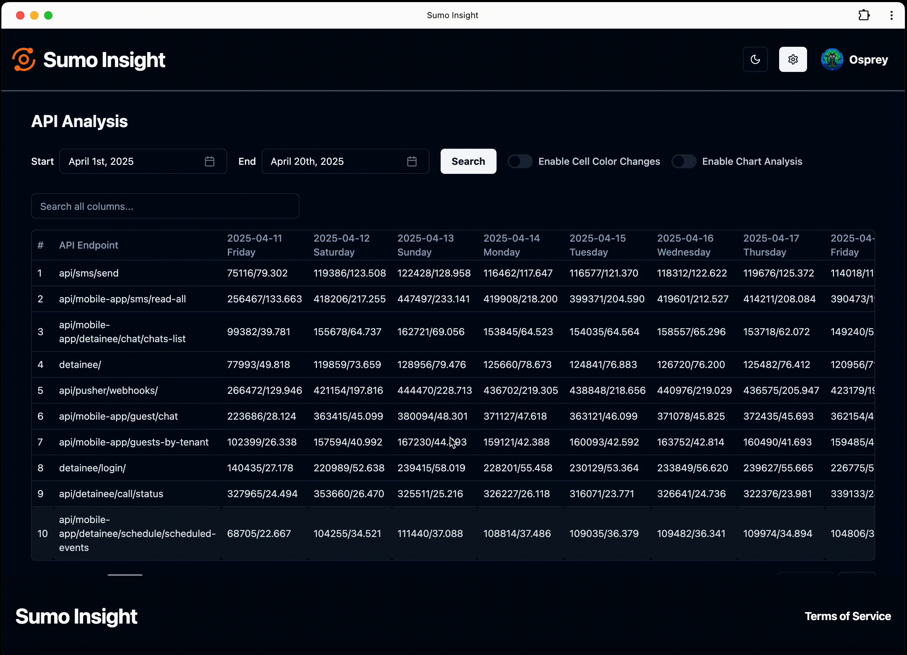
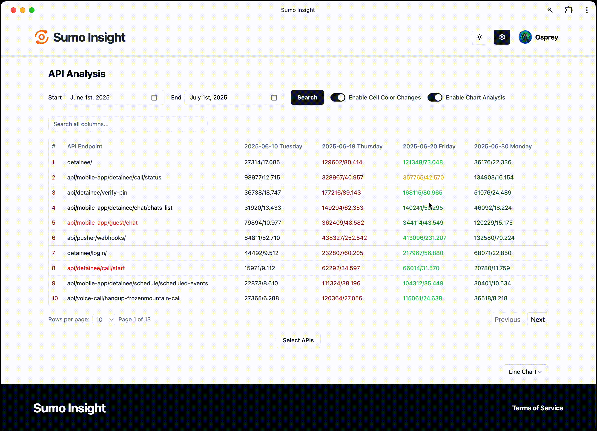
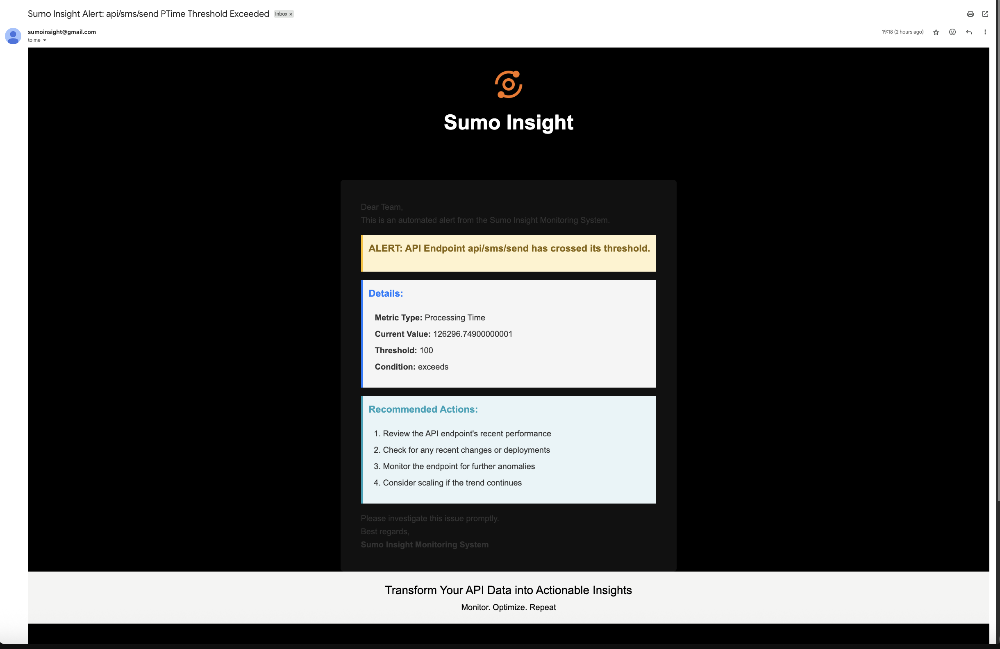

# sumo-insight-frontend
Turning raw API data into actionable intelligence. Visualizing intelligence — clean UI to explore and interact with API-driven insights.
---

## 📊 Sumo Insight – API Performance Monitoring Tool

**Sumo Insight** is a web application developed for personal use to monitor and analyze the API performance of a high-traffic application I am currently working on.

In addition to traditional metrics tracking, **Sumo Insight** can also be integrated with AI platforms like **OpenAI**, **DeepSeek**, or **Hugging Face**. This allows you to perform intelligent API behavior analysis, where **AI** can interpret log patterns and trigger email/call alerts automatically based on its assessment.

---
### 🔗 Live Demo

You can view a live demo of the application by visiting the link below.
To explore sample data, select the date range **April 1, 2025 – April 30, 2025** in the dashboard.

🌐 **[View Demo](https://sumo-insight.onrender.com)**

🖥️ **[Frontend Repository](https://github.com/sanju9645/sumo-insight)**

🛠️ **[Backend Repository](https://github.com/sanju9645/sumo-insight-backend)**
---
### 🧭 Purpose

The application I support experiences **heavy user traffic**, resulting in a **large number of API calls each day**. If any API takes too long to respond, it can cause **connection failures**, negatively impacting both **user experience** and **company revenue**.

To prevent such issues and proactively address performance bottlenecks, this tool helps **track and analyze API metrics** over time.

---

### 🔌 Integration with Sumo Logic

* The production application is integrated with [Sumo Logic](https://www.sumologic.com/), which collects and stores **API logs**.
* However, **Sumo Logic retains logs for only 1 month**, which limits historical analysis.
* **Sumo Insight** bridges this gap by:

  * Fetching summarized API data daily (e.g., call count, average processing time).
  * Storing it in a local database for **long-term analysis**.

#### ⏱️ Example Cron Job:

```bash
0 0 * * * /path/to/node /path/to/project/node_modules/.bin/ts-node /path/to/sumologic-log-processor.ts
```

This cron job runs daily and:

* Executes a custom Sumo Logic query.
* Fetches relevant API performance data.
* Saves it to a local database for dashboard display and trend analysis.

---

### 📈 Key Features

#### 🗓️ Historical Filtering

* Select a **custom time range** to view past API performance data and identify anomalies.
  

#### 🔍 API Performance Dashboard

* Visualize API behavior using **tables** or **graphs**.
  
* Each API’s performance is **color-coded** to highlight trends:

  * Green = improved
  * Yellow = consistent
  * Red = degraded

  

#### ⚙️ Configuration Panel

A dedicated page to customize the system:

* ✏️ **Dashboard Notes**: Add contextual notes that appear on the dashboard.
* 🧾 **Editable Sumo Logic Query**: Modify the query used to fetch data.
* 🎨 **Custom API Colors**: Assign fixed colors to specific APIs for easier identification.

  
  
#### 🚨 Alerting System

* Set thresholds for:

  * API call count
  * Average processing time
* If thresholds are exceeded:

  * 📧 Send an **alert email** to configured email addresses.
  * 📞 Trigger an **automated phone call** that reads out the affected API and its metrics.

  

  

<p align="center">
  
</p>
---

### ✅ Benefits

* Provides **real-time insight** into API behavior.
* Enables **long-term tracking** beyond Sumo Logic’s default 1-month retention.
* Helps identify **performance degradation early**.
* Improves ability to take **data-driven action** before user impact.

---
